<p align="left">
    <a href="README.md">
        中文
    </a>
    <span> • </span>
    <span>
        <b>English</b>
    </span>
</p>

<h1 align="center">Doc-Image-Tool Document image processing tool</h1>
<br>
<div align="center">
  <strong>Free, open source, document image processing software</strong><br>
</div><br>

- **Free**：All the code in this project is open source and completely free.
- **Convenience**：Decompress and run offline without a network.
- **Function**：DocBleach / TextOrientationCorrection / DocSharpening / HandwritingDenoisingBeautifying / DocShadowRemoval / document_image_dewarping / DocTrimmingEnhancement

<p align="center">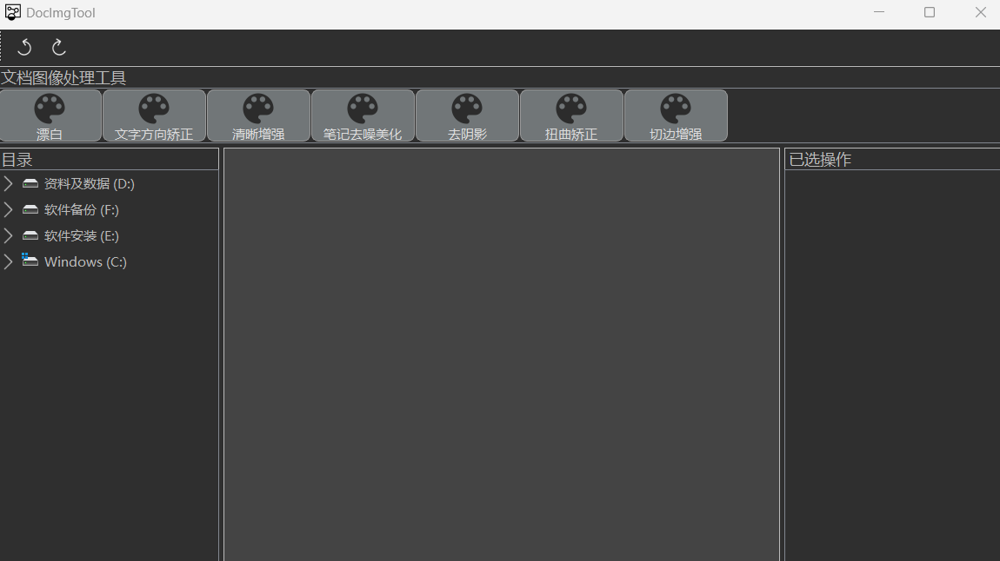</p>

## catalog

- [DocBleach](#DocBleach)
- [TextOrientationCorrection](#TextOrientationCorrection)
- [DocSharpening](#DocSharpening)
- [HandwritingDenoisingBeautifying](#HandwritingDenoisingBeautifying)
- [DocShadowRemoval](#DocShadowRemoval)
- [document_image_dewarping](#document_image_dewarping)
- [DocTrimmingEnhancement](#DocTrimmingEnhancement)

## usage

To use the current method, you just download the source code of this project, find main.py, and run it.

The weights model includes distortion correction, clarity enhancement and cutting edge enhancement.Baidu web disk download:

link: https://pan.baidu.com/s/1Ty_JSYcauRX0MiIRuhxx_w  password: 92vb

Any problems，please [Issue](https://github.com/jiangnanboy/Doc-Image-Tool/issues) ，I'll help you as much as I can.。

### DocBleach
Bleach the document image.

<p align="center">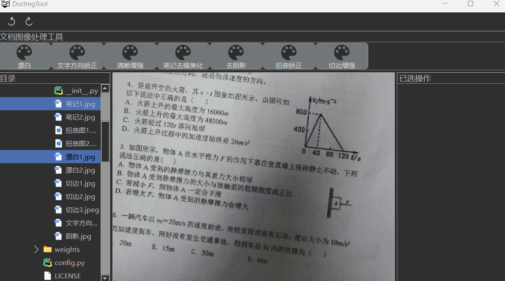</p>

<p align="center">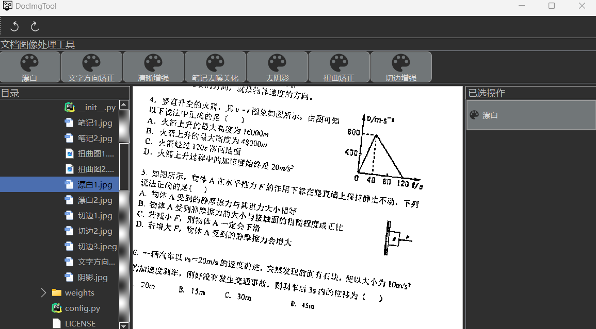</p>

### TextOrientationCorrection
Text orientation correction of document images.

<p align="center">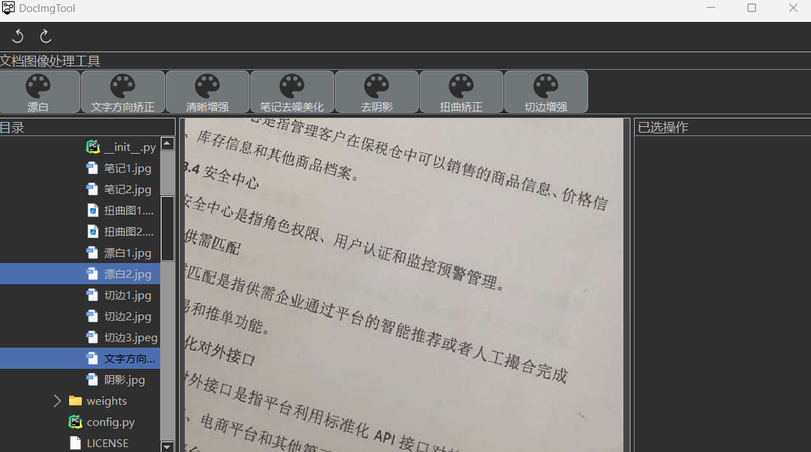</p>

<p align="center">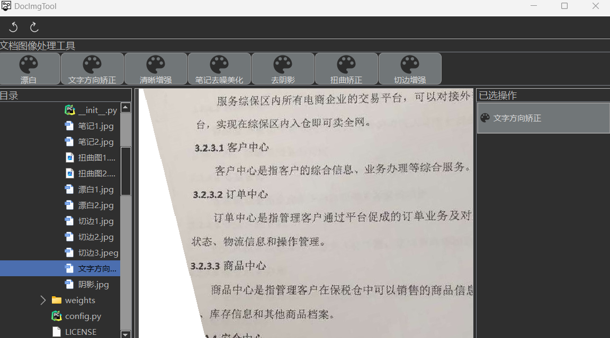</p>

### DocSharpening
Sharpening a document image enhances the sharpness of any image, which increases the image size.

### HandwritingDenoisingBeautifying
De-noising and beautifying handwritten note images.

<p align="center">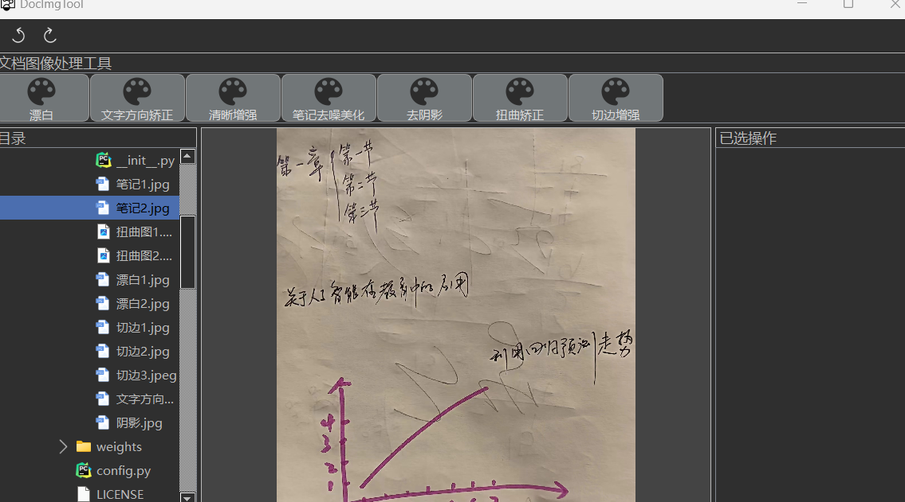</p>

<p align="center">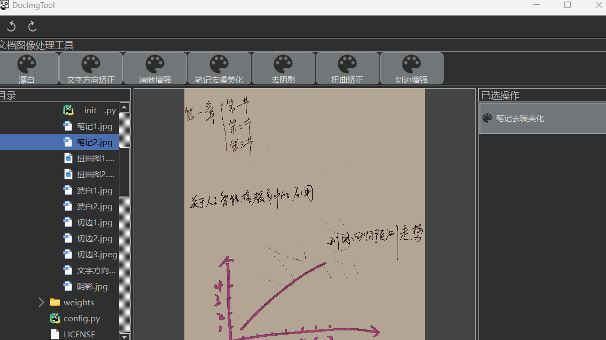</p>

### DocShadowRemoval
Remove shadow from document image.

<p align="center">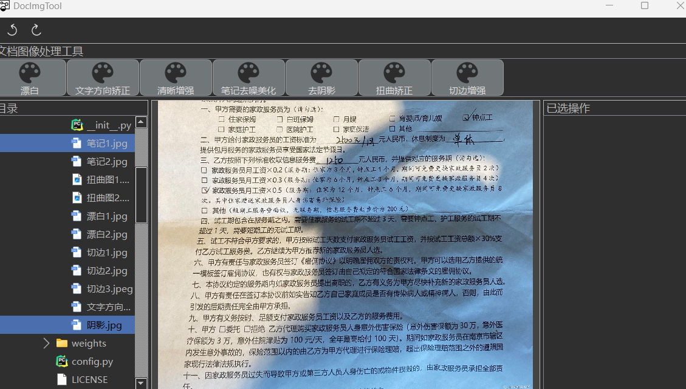</p>

<p align="center">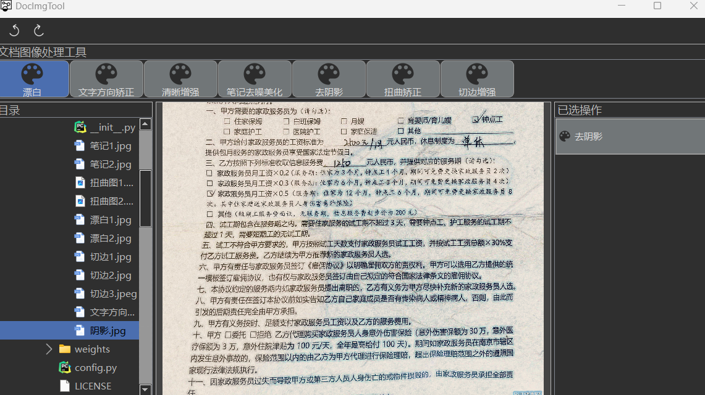</p>

### document_image_dewarping
Distortion correction of document images.

<p align="center">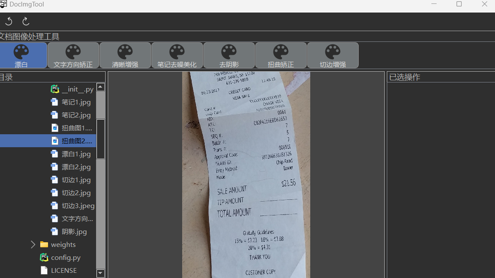</p>

<p align="center">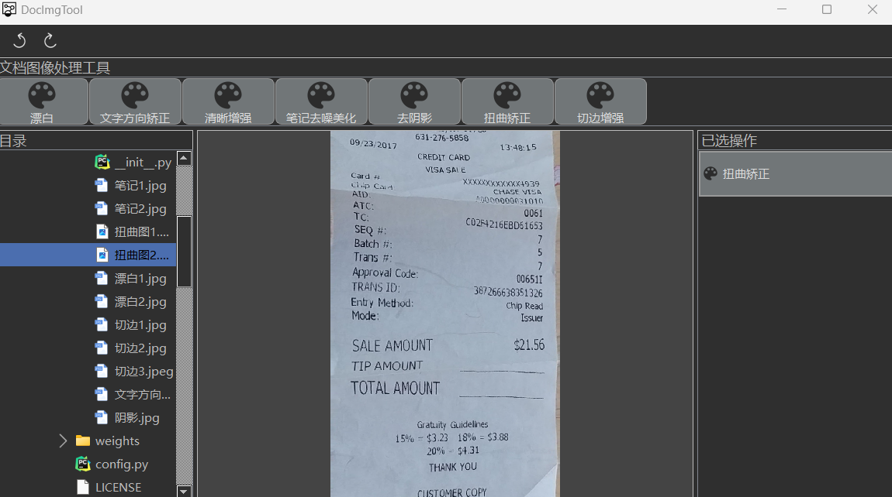</p>

### DocTrimmingEnhancement
Trim the document image, extract and highlight the main part.

<p align="center">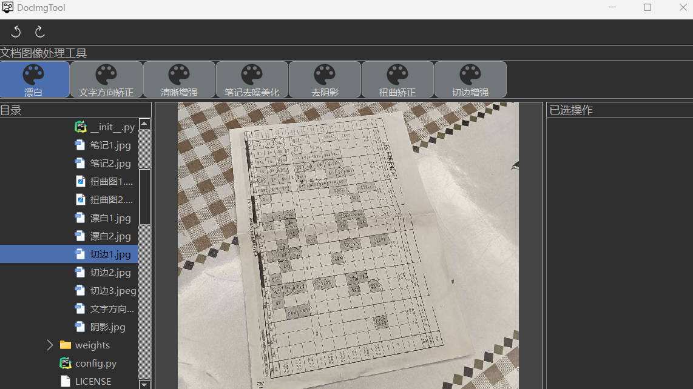</p>

<p align="center">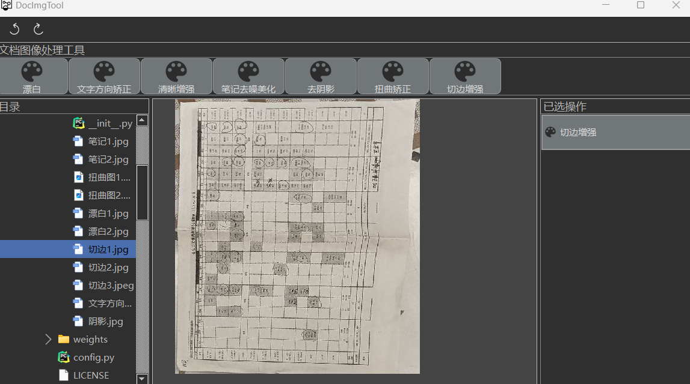</p>

---

### Project core algorithm source code：

```
function_method
├─ DocBleach #漂白
├─ TextOrientationCorrection #文字方向矫正
├─ DocSharpening #清晰增强
├─ HandwritingDenoisingBeautifying #笔记去噪美化
├─ DocShadowRemoval #去阴影
├─ document_image_dewarping #扭曲矫正
└─ DocTrimmingEnhancement #切边增强

```
---

## sponsor

Doc-Image-Tool, The project is developed and maintained by author [jiangnanboy](https://github.com/jiangnanboy) in his spare time. If you like this software, you are welcome to sponsor it, which is also one of the motivation of the author.

- Domestic users sponsor authors through [爱发电](https://afdian.com/a/jiangnanboy) .

## development plan

<details>
<summary>finished work</summary>

- DocBleach
- TextOrientationCorrection
- DocSharpening
- HandwritingDenoisingBeautifying
- DocShadowRemoval
- document_image_dewarping
- DocTrimmingEnhancement

</details>

##### Work in progress, or if you have any good functional suggestions, please also put forward [suggestions], I will try my best to implement the functional requirements.

- [ ] Blackspot removal
- [ ] In paint 
- [ ] Remove stamp
- [ ] Handwriting erasure.

##### Continuity Plan

<details>
<summary>Expand</summary>

The following are some of the future ongoing plans.

- [ ] Reconstructs software interface
- [ ] Add more document image processing capabilities
- [ ] Added the OCR function
- [ ] Added table recognition function
- [ ] Added document image multimodal question answering function

</details>


## Contact me

1、github：https://github.com/jiangnanboy

2、QQ:2229029156
